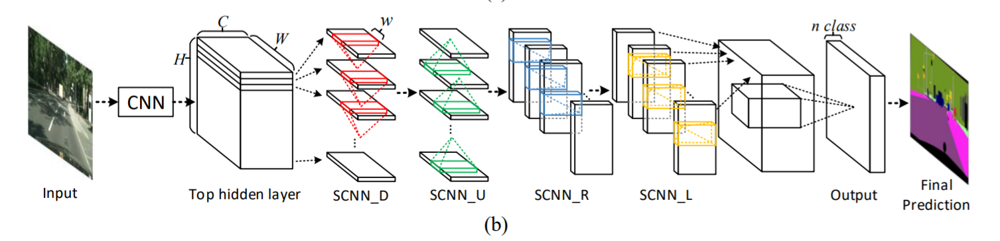
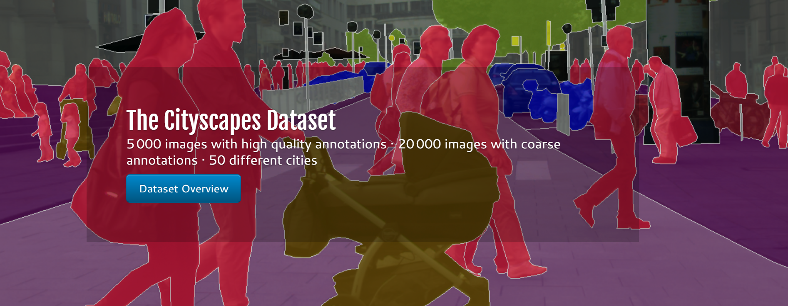

# pytorch-SCNN

**Update on 2018/12/15.

 ### TODO
- [x] Support different backbones
- [x] Support Cityscapes 
- [x] Single-GPU training


### Introduction
This is a PyTorch(0.4.1) implementation of [Spatial CNN ](https://arxiv.org/abs/1712.06080). It
can use Modified Aligned  ResNet as backbone. Currently, we train SCNN
using Cityscapes datasets.




### Installation
The code was tested with Anaconda and Python 3.6. After installing the Anaconda environment:

0. Clone the repo:
    ```Shell
    git clone https://github.com/forlovess/SCNN-pytorch.git
    cd SCNN-pytorch
    ```

1. Install dependencies:

    For PyTorch dependency, see [pytorch.org](https://pytorch.org/) for more details.

    For custom dependencies:
    ```Shell
    pip install matplotlib pillow tensorboardX tqdm
    ```
### Training
Fellow steps below to train your model:

1. Input arguments: (see full input arguments via python train.py --help):
    ```Shell
    usage: train.py [-h] [--backbone {resnet,drn,mobilenet}] [--path PATH]
                [--out-stride OUT_STRIDE] [--dataset DATASET] [--workers N]
                [--base-size BASE_SIZE] [--crop-size CROP_SIZE]
                [--loss-type {ce,focal}] [--epochs N] [--start_epoch N]
                [--batch-size N] [--test-batch-size N]
                [--use-balanced-weights] [--lr LR]
                [--lr-scheduler {poly,step,cos}] [--momentum M]
                [--weight-decay M] [--nesterov] [--no-cuda]
                [--gpu-ids GPU_IDS] [--seed S] [--resume RESUME]
                [--checkname CHECKNAME] [--eval-interval EVAL_INTERVAL]
                [--no-val]

    ```

### Acknowledgement
This repo is built upon [SCNN](https://github.com/XingangPan/SCNN) and [LaneNet](https://github.com/MaybeShewill-CV/lanenet-lane-detection)
and [pytorch-deeplab-xception](https://github.com/jfzhang95/pytorch-deeplab-xception).
